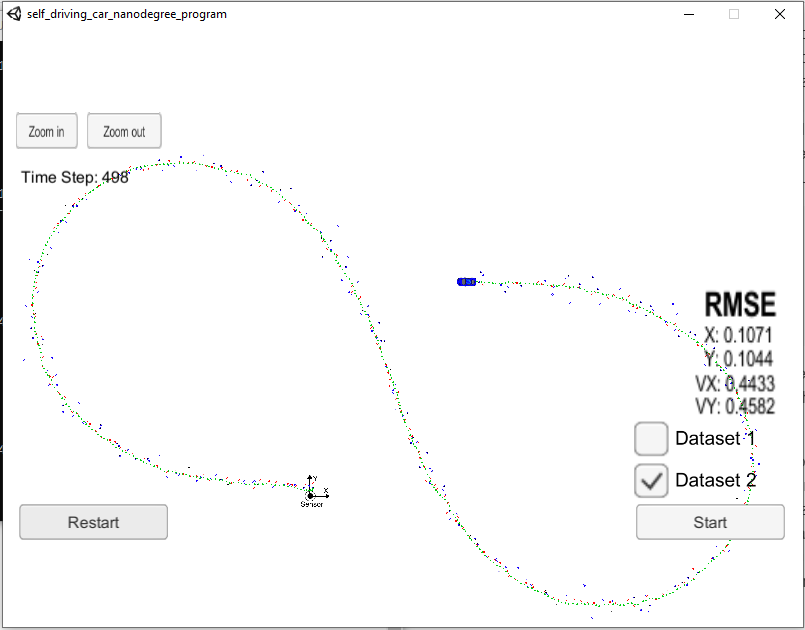

# Extended Kalman Filter Project
Self-Driving Car Engineer Nanodegree Program

In this project a kalman filter was used to estimate the state of a moving object of interest with noisy lidar and radar measurements. The RMSE values (Error between the estimated values and the ground truth) were found to be lower than the tolerance outlined in the project rubric. 

## Important Dependencies
1. The Udacity Term 2 Simulator which can be downloaded [here](https://github.com/udacity/self-driving-car-sim/releases).
2. uWebSocketIO: The repository includes two files that can be used to set up and install [uWebSocketIO](https://github.com/uWebSockets/uWebSockets) for either Linux or Mac systems. 
3. cmake >= 3.5
4. make >= 4.1 (Linux, Mac), 3.81 (Windows)
5. gcc/g++ >= 5.4

Here is the main protocol that main.cpp uses for uWebSocketIO in communicating with the simulator.

**INPUT**: values provided by the simulator to the c++ program

["sensor_measurement"] => the measurement that the simulator observed (either lidar or radar)

**OUTPUT**: values provided by the c++ program to the simulator

["estimate_x"] <= kalman filter estimated position x

["estimate_y"] <= kalman filter estimated position y

["rmse_x"]

["rmse_y"]

["rmse_vx"]

["rmse_vy"]

## Basic Build Instructions

1. Clone this repo.
2. Make a build directory: `mkdir build && cd build`
3. Compile: `cmake .. && make` 
   * On windows, you may need to run: `cmake .. -G "Unix Makefiles" && make`
4. Run it: `./ExtendedKF `

## Overview of the Algorithm

### Input to the Filter
The input data consisted of the following columns: Raw Measurements, Timestamp and Ground Truth values of the positions and velocities of the object to be tracked. The raw measurements are the noisy measurement values taken from Lidar and Radar. They are positions in X and Y axis (px and py) for the lidar measurements and the radius (rho) , azimuth angle (psi) and the velocity (rho_dot) for the radar measurements. The timestamp is in microseconds and denotes the timestamp the data was captured. The Ground Truth values are the actual values of the positions and velocities of the object in the X and Y axes (px, py, vx, vy) and is to be used for comparison with the estimated values of the same obtained from the Kalman filter.

### Output from the Filter
The Output of the Kalman Filter are the estimated values of the positions and velocities of the object in X and Y axes (px, py, vx and vy). These estimates are fed into the simulator for marking and are also compared with the ground truth values to evaluate the performance of the filter.

### The Extended Kalman Filter
The Extended Kalman Filter consists of a prediction and an update step. 

#### Prediction step: 
The prediction step predicts the values of the states (px, py, vx and vy) based on the state transition equations. The state co-variance matrix is updated based on the process noise of the prediction step.
				
                x' = F * x
                P' = F * P * F' + Q
where x' is the new state matrix, F is the transition matrix, P is the state co-variance matrix and Q is the process co-variance matrix. The matrices F and Q are calculated based on the time difference between the last update and the time for which the state is being predicted (dt).

####Update Step:
The measurements obtained from the Lidar or the Radar are then used to update the predicted states. The measurement matrix is used to obtain the predicted measurement values from the predicted states. Since the Radar measurements are in polar co-ordinates and the states are in cartesian co-ordinates, the measurement matrix for the Radar is non-linear in nature. Hence, an extended Kalman filter is used for the radar measurements which involves linearizing the measurement matrix. The following are the equations for the update step for Lidar measurement update:

				y = z - H * x
                S = H * P * H' + R
                K = P * H' * S.inverse
                x = x + K * y
                P = (I - K * H) * P
                
The y = z - H * x equation is replaced by y = z - h' where h is the non-linear radar measurement matrix and H is replaced by the Hj which is the jacobian of the non linear radar measurement matrix.  

The KalmanFilter.cpp file has the functions for the above mentioned Prediction and Update steps. The FusionEKF.cpp class has the generic flow of the algorithm. The prediction function is called first to predict the future values of the states based on the present values and then the estimates are updated based on the measurements received. The Tools class has functions for calculating the RMSE values and the Jacobian matrix. The Main.cpp file is used to interact with the simulator.

## Evaluation

The RMSE values were found to be less than [.11, .11, 0.52, 0.52] as dictated by the project rubric to pass the project. 
         
                
                
                
                

               